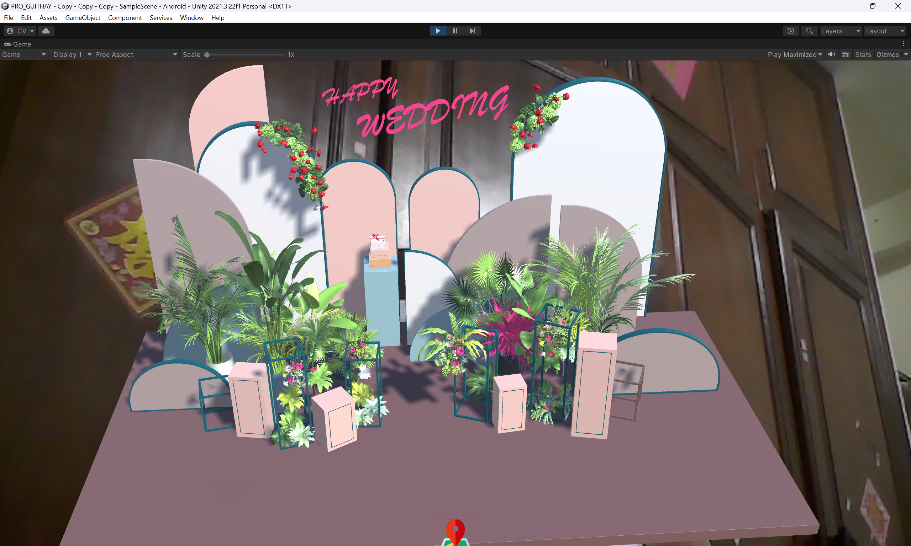

# AR Wedding Invitation - Web Build

Welcome to the AR Wedding Invitation project! This project showcases an innovative and interactive way to deliver wedding details using augmented reality technology. Guests can experience the joy of our special day through their devices, witnessing virtual elements that breathe life into our love story and event information. This guide will walk you through the process of setting up and running the AR Wedding Invitation web application.

  

## Video Preview

Get a glimpse of the AR Wedding Invitation experience by watching the video below:

  

  <em>Click the image above to watch the video.</em>

## Getting Started

To run the AR Wedding Invitation web application, follow these steps:

1. Clone this repository to your local machine:
git clone https://github.com/YourUsername/AR-Wedding-Invitation-Project.git

2. Locate the `webgl.rar` file in the `Build/` directory.

3. Extract the contents of the `webgl.rar` file.

4. Move the extracted files into the `Build/` directory.

5. Open a web browser and navigate to the `index.html` file in the `Build/` directory.

6. Experience the AR Wedding Invitation by interacting with the web application.

## Notes

- If you encounter any issues while running the web application, please refer to the troubleshooting section in the [wiki](https://github.com/CaoQuocViet/AR-Wedding-Invitation-Web/wiki).
- Make sure to replace `YourUsername` in the repository URL with your actual GitHub username.

## License

This project is licensed under the [MIT License](LICENSE).

---

For more information about the AR Wedding Invitation project and its development, please visit the [project repository](https://github.com/CaoQuocViet/AR-Wedding-Invitation-Web).

